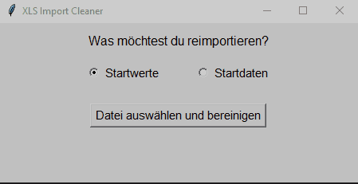

# XLS Import Cleaner (Proof of Concept)


[](README_en.md)
[](README.md)


## Problemstellung

Beim Re-Import von Excel-Dateien in HR-Systeme (zum Beispiel zur Aktualisierung von Mitarbeiterdaten) besteht die Gefahr, dass unbeabsichtigt bestehende Datensätze überschrieben oder gelöscht werden. Der manuelle Bereinigungsprozess vor dem Import ist fehleranfällig und zeitaufwendig.

## Zielsetzung

Dieses Tool soll den Prozess der Datenbereinigung automatisieren, um Fehler zu vermeiden und Zeit zu sparen. Es handelt sich um eine technische Machbarkeitsstudie (Proof of Concept) zur Validierung des Lösungsansatzes.

## Funktionsweise

- Öffnet `.xls` / `.xlsx`-Dateien
- Leert oder entfernt vordefinierte Zellen, Spalten oder Zeilen
- Speichert eine bereinigte Kopie der Datei zur Weiterverarbeitung

## Demo



## Tests

Dieses Projekt nutzt [pytest](https://docs.pytest.org/) für automatisierte Tests.

### Ausführen der Tests (lokal)
### Getestet wird:

- ✅ Erfolgreicher Bereinigungslauf mit Beispiel-Datei  
- ❌ Korrektes Fehlverhalten bei fehlender „Personalnummer“  
- 📝 Weitere Tests geplant

Die Tests laufen automatisch bei jedem Push via [GitHub Actions](https://github.com/Chrisp-Codes/xls-import-cleaner/actions).


```bash
pip install -r requirements.txt
pytest
````

## Status

- Nicht für den produktiven Einsatz vorgesehen
- Entwickelt und getestet mit anonymisierten Beispiel- und Testdaten
- Dient ausschließlich der technischen Demonstration

## Technologien

- Python 3.x
- openpyxl (Excel-Dateiverarbeitung)
- tkinter (GUI)
- Optional: pyinstaller (für die Erstellung einer ausführbaren Datei)

## Kompilierung als `.exe` (optional)

```bash
pip install pyinstaller
pyinstaller --onefile --noconsole src/gui.py
